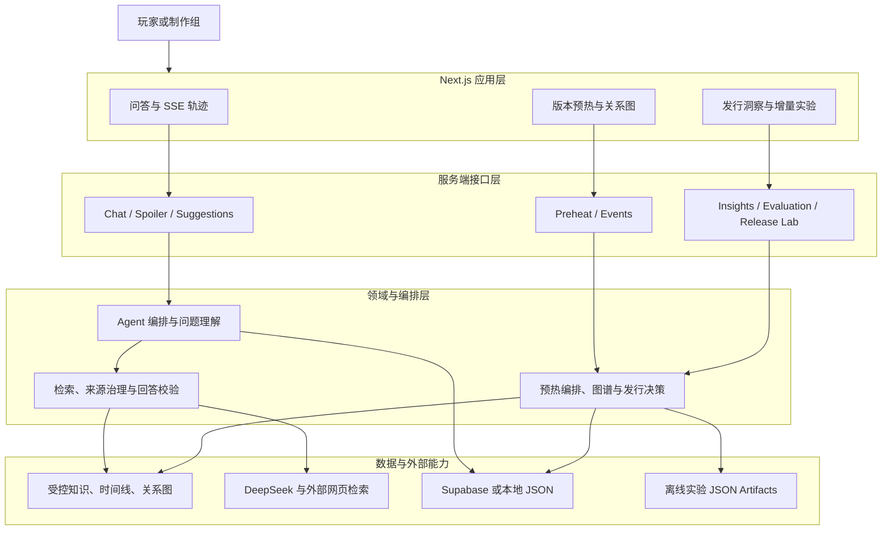
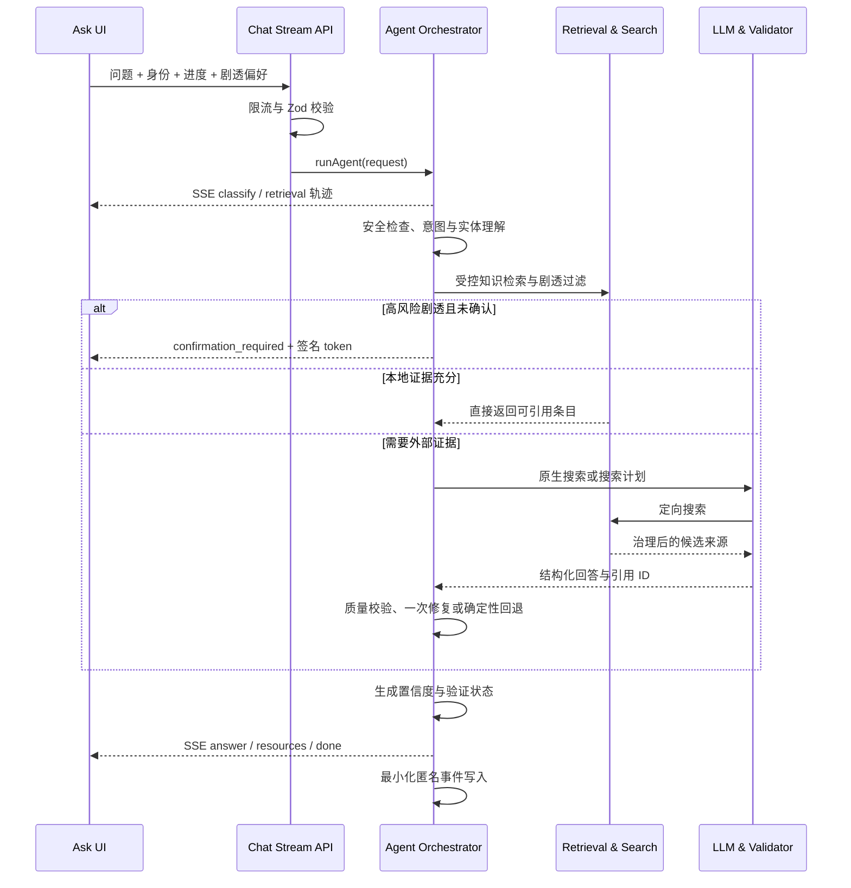
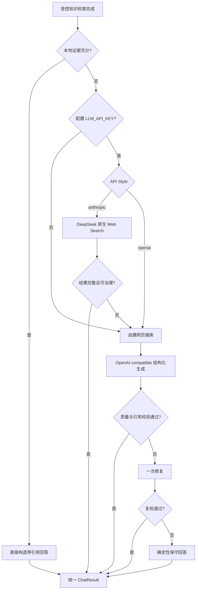
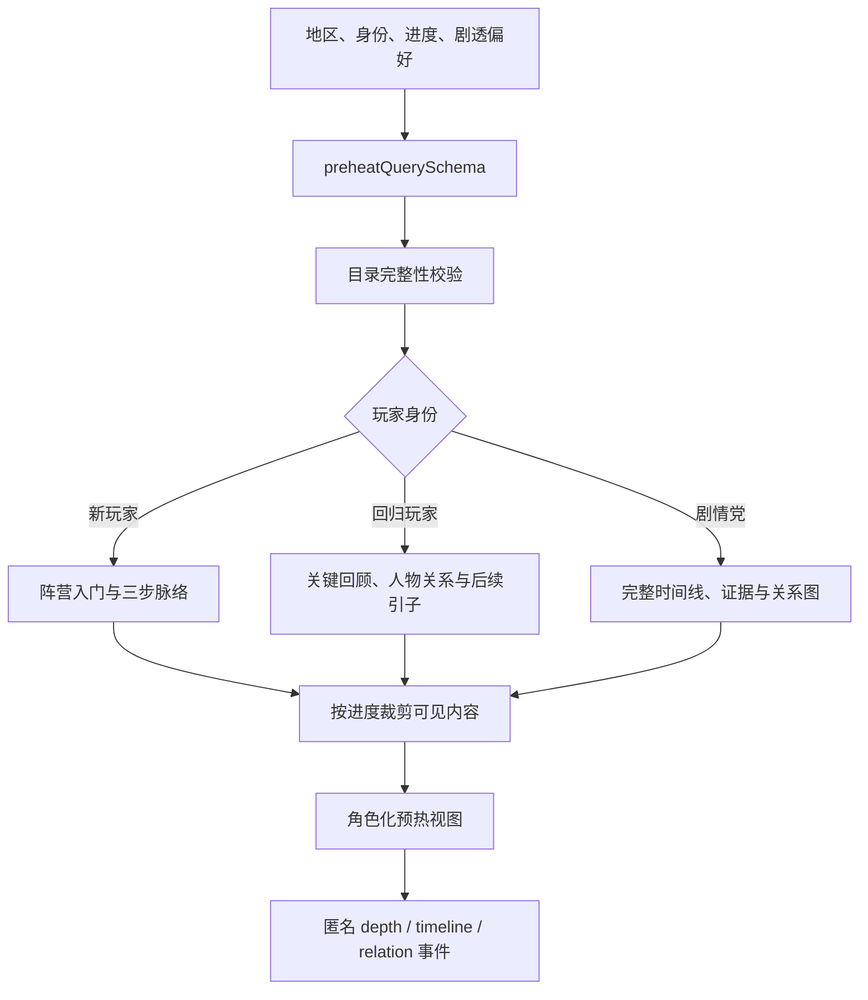
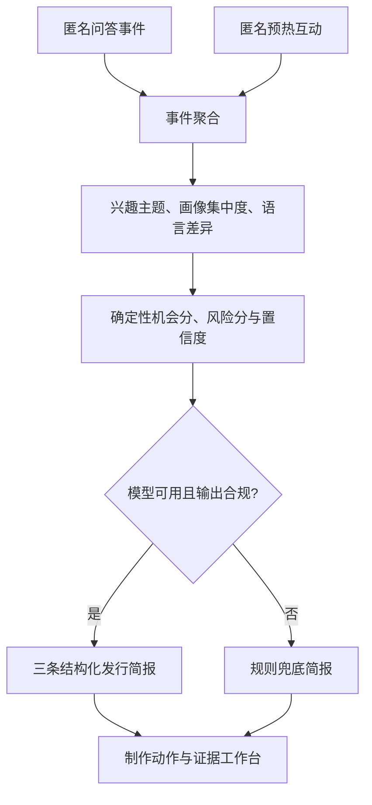
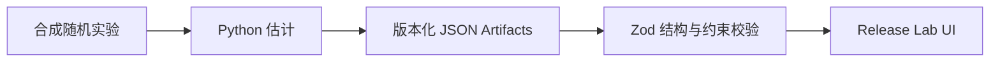

# 派蒙三千问 · Paimon Asks Everything

> 面向《原神》国际化发行场景的证据约束 AI Agent Demo：为玩家提供按进度、身份、语言和剧透偏好适配的问答与版本预热，并将匿名交互信号转化为可审核的发行洞察。

**在线体验：** [paimon-asks-everything.vercel.app](https://paimon-asks-everything.vercel.app/)


## 目录

- [项目定位](#项目定位)
- [核心能力](#核心能力)
- [系统架构](#系统架构)
- [执行链路](#执行链路)
- [模块拆解](#模块拆解)
- [数据与安全边界](#数据与安全边界)
- [技术栈](#技术栈)
- [快速开始](#快速开始)
- [配置说明](#配置说明)
- [测试与评测](#测试与评测)
- [发行增量实验室](#发行增量实验室)
- [已知限制与后续计划](#已知限制与后续计划)

## 项目定位

《原神》的世界观、角色关系和任务文本持续增长，但玩家需要的并不是同一份百科式答案：新玩家需要低门槛解释，回归玩家需要最小必要回顾，剧情党需要完整证据链，探索玩家则希望先获得提示而不是直接看到解法。

本项目以“派蒙作为游戏内向导”为产品载体，将玩家服务与发行分析连接成闭环：

1. **玩家侧**：回答世界观、角色、剧情和玩法问题；按玩家进度控制剧透；提供版本预热、关系图谱和延伸阅读。
2. **制作组侧**：只采集最小化、默认匿名的交互信号；聚合玩家兴趣与理解断点；生成带证据约束的发行建议草稿。
3. **实验侧**：用固定种子的合成随机实验演示 Uplift、Holdout、置信区间和渠道归因方法，但不把演示数字解释为真实业务效果。

项目遵循四个核心约束：

- **证据优先**：回答只能引用受控知识或经过来源治理的外部资料；证据不足时明确降级，不补写确定事实。
- **剧透可控**：内容可见性由玩家进度、剧透偏好和问题风险共同决定；关键身份反转和完整故事线需要二次确认。
- **模型可替换、流程可退化**：模型、原生搜索、Supabase 任一不可用时，核心 Demo 仍有确定性路径可运行。
- **洞察不越权**：规则负责分数和安全边界，模型只生成结构化解释与建议；所有建议均为待审核草稿。

## 核心能力

| 页面 / 接口 | 面向对象 | 核心能力 |
|---|---|---|
| 首页 `/` | 玩家 | 至冬 7.0 倒计时、官方影像、新角色预览、关系图入口 |
| 问派蒙 `/ask` | 玩家 | 中英文问答、流式执行轨迹、真实来源引用、剧透确认、延伸阅读 |
| 版本预热 `/preheat` | 玩家 | 按地区与新玩家 / 回归玩家 / 剧情党生成差异化内容 |
| 至冬关系图 | 玩家 | 角色、组织、概念和文本证据的交互式探索 |
| 发行洞察 `/insights` | 制作组 | 玩家需求切片、机会与风险评分、行动清单、证据工作台 |
| 增量实验 `/release-lab` | 发行 / 数据分析 | PV × 玩家 Uplift、安全触达、达人 × 展会 2×2 归因 |
| 技术评测 `/api/evaluation` | 开发者 | 固定问题集上的状态、引用、来源类型、剧透门控等确定性检查 |

### 三类版本预热视图

版本预热不是只改变标题，而是让“地区 × 旅行者身份”真正决定返回的数据结构和页面信息密度：

- **新玩家**：阵营入门、三步剧情脉络、低剧透说明；不展示完整时间线和证据详情。
- **回归玩家**：关键剧情回顾、当地人物关系和尚未回答的问题，用最小成本接回主线。
- **剧情党**：完整已实装时间线、详细事件、证据、关系图与延伸问题。

当前覆盖蒙德、璃月、稻妻、须弥、枫丹、纳塔、挪德卡莱与至冬。

## 系统架构

### 总体结构



### 分层职责

| 层级 | 目录 | 责任边界 |
|---|---|---|
| 页面与组件 | `app/`、`components/` | 页面路由、玩家偏好状态、SSE 展示、关系图和决策台交互 |
| API 边界 | `app/api/` | Zod 参数校验、限流、SSE、HTTP 状态码和服务端能力暴露 |
| Agent 编排 | `lib/agent.ts` | 安全拒答、问题理解、剧透门控、检索与生成编排、事件落库 |
| 证据系统 | `lib/retrieval.ts`、`lib/external-search.ts`、`lib/source-governance.ts` | 本地受控检索、外部搜索、实体相关性、来源分级和证据筛选 |
| 模型适配 | `lib/generation.ts`、`lib/deepseek-anthropic.ts`、`lib/native-search-adapter.ts` | Anthropic Messages / OpenAI-compatible 路由、工具调用、结果解析、失败回退 |
| 质量控制 | `lib/answer-quality.ts`、`lib/evidence-quality.ts`、`lib/verification.ts` | 语言、引用、主题相关性、权威性措辞和结构完整性校验 |
| 产品编排 | `lib/preheat.ts`、`lib/snezhnaya-graph.ts` | 按身份与进度生成预热视图，构建和校验关系图谱 |
| 洞察与决策 | `lib/insights.ts`、`lib/release-insights.ts`、`lib/release-ai-briefing.ts` | 聚合匿名信号、确定性评分、AI 简报和规则兜底 |
| 存储 | `lib/event-store.ts`、`lib/preheat-event-store.ts`、`supabase/` | Supabase / 本地 JSON 双后端与最小化数据写入 |
| 离线实验 | `scripts/release_lab/`、`artifacts/release-lab/` | 生成合成随机实验、估计 Uplift / 渠道增量、产出前端只读报告 |

## 执行链路

### 1. 问答主链路



主链路的关键步骤：

1. **请求边界**：`/api/chat` 和 `/api/chat/stream` 使用 `chatRequestSchema` 校验问题、语言、玩家身份、剧情进度、剧透偏好、关注方向和会话 ID；服务端对公开接口进行进程内限流。
2. **安全拒答**：对外挂、自动化脚本、账号交易等请求直接返回 `safe_refusal`，不进入搜索与生成。
3. **问题理解**：规则分类与实体词典先给出类别、实体、意图和候选查询；配置模型时可补充理解结果，并与规则结果对齐。理解结果带 30 分钟进程内缓存。
4. **受控检索**：从本地双语知识条目中做别名扩展、同语言优先、实体相关性和词法排序，再根据剧情进度与剧透偏好过滤。
5. **剧透门控**：完整故事线或高风险身份反转在未确认时停止执行，返回与原问题绑定、有效期 10 分钟的 HMAC 签名 token；确认接口校验 token 后才允许 Level 3 内容进入检索。
6. **本地充分性判断**：如果受控条目已经覆盖问题，直接以 `source-*` 引用生成回答，避免无必要的模型与网络调用。
7. **搜索路由**：默认尝试 DeepSeek Anthropic Messages 原生 Web Search；原生搜索失败、不完整或缺乏有效来源时，切到 OpenAI-compatible 工具调用与自建搜索链路。无模型密钥时仍可运行自建搜索与确定性回答。
8. **来源治理**：统一规范化 URL、去重、判断平台与发布者身份、区分官方 / 可信 Wiki / 社区 / 未知网页，并结合问题实体和意图排序。
9. **回答校验**：模型只能引用提供的 source ID；输出还会检查语言、空回答、跑题、引用越界、权威性过度声称和角色成长线覆盖。可修复错误最多追加一次修复请求，仍失败则返回保守的确定性答案。
10. **渐进返回**：流式接口先返回执行轨迹和主回答，再异步补充延伸阅读；前端不需要理解底层搜索供应商的响应格式。
11. **事件记录**：默认只记录语言、玩家类型、问题类别、困惑主题、是否触发剧透门控、是否使用外部搜索和回答状态；只有用户明确同意时才保存问题文本。

### 2. 搜索与生成的降级路径



两条模型路线最终都归一为 `GroundedGenerationResult`，再由 Agent 组装为统一的 `ChatResult`。因此 UI、评测和事件系统不依赖具体模型供应商。

### 3. 版本预热与关系图链路



预热目录在服务端返回前会校验：主题引用的概念是否存在、时间线节点和关系图是否有效、关系边是否落在图内、各地区导览是否完整。这样可以在数据更新时尽早暴露断链，而不是让页面静默缺失内容。

### 4. 匿名事件到发行决策



该链路有两个明确边界：

- **分数由规则计算**：`computeReleaseDecisions()` 负责机会、风险、置信度、发布窗口和 `amplify / explain / hold` 决策；模型不修改分数。
- **生成受白名单约束**：AI 简报必须正好输出三条建议，主题、格式、窗口、受众、复用模块和 `evidenceRefs` 都必须来自允许集合；解析或引用失败时整份回退到规则版本。

### 5. 发行增量实验链路

增量实验室与线上问答数据解耦：Python 脚本生成固定种子的合成随机实验，离线估计后写入 JSON artifacts；Next.js 只负责用 Zod 校验并展示结果。



## 模块拆解

### API 路由

| 路由 | 方法 | 职责 |
|---|---|---|
| `/api/chat` | `POST` | 非流式问答入口 |
| `/api/chat/stream` | `POST` | SSE 问答入口；发送 `trace`、`answer`、`resources`、`done` 事件 |
| `/api/chat/confirm-spoiler` | `POST` | 校验问题绑定的剧透确认 token，并以已确认模式重新执行 Agent |
| `/api/question-suggestions` | `POST` | 按主题、身份与进度生成建议问题，并提供固定兜底 |
| `/api/preheat` | `GET` | 校验预热目录并返回角色化预热视图 |
| `/api/preheat/events` | `POST` | 校验目标节点后记录匿名预热互动 |
| `/api/feedback` | `POST` | 为已记录问答更新 helpful 反馈 |
| `/api/insights` | `GET` | 聚合问答和预热事件，生成发行决策与 AI / 规则简报 |
| `/api/evaluation` | `POST` | 运行全部或指定固定评测用例，不写入洞察事件 |
| `/api/release-lab` | `GET` | 读取并校验离线增量实验 artifacts |

### Agent、检索与生成

| 模块 | 主要职责 |
|---|---|
| `lib/agent.ts` | 单 Agent 总编排；统一所有提前返回、搜索、生成、推荐和事件写入 |
| `lib/classification.ts` | 问题类别、深剧情意图和高风险剧透识别 |
| `lib/question-understanding.ts` | 规则 + 可选模型的问题理解、实体对齐、搜索计划与 TTL 缓存 |
| `lib/entity-lexicon.ts` | 双语实体、别名和角色成长线识别 |
| `lib/retrieval.ts` | 本地受控语料的别名扩展、实体匹配、词法排序、进度和剧透过滤 |
| `lib/local-evidence.ts` | 判断本地证据是否足以直接回答，减少不必要搜索 |
| `lib/external-search.ts` | Wiki provider、通用网页搜索、页面正文抽取和候选来源排序 |
| `lib/search-router.ts` | 搜索后端分层、超时隔离、尝试记录、去重和跨后端合并 |
| `lib/source-governance.ts` | 平台、发布者、内容类型、权威等级与来源可信度评估 |
| `lib/native-web-search.ts` | DeepSeek 原生搜索响应块、正文、结果和停止原因解析 |
| `lib/native-search-adapter.ts` | 原生搜索结果到统一 Citation / GroundedGenerationResult 的适配 |
| `lib/deepseek-anthropic.ts` | Anthropic Messages 请求、超时、UTF-8 与 `pause_turn` 续传 |
| `lib/generation.ts` | API 风格路由、工具调用、证据组装、生成、修复和确定性回退 |
| `lib/answer-prompt.ts` | 中英文系统提示和结构化输出约束 |
| `lib/answer-quality.ts` | 回答解析、语言匹配、引用有效性和质量失败原因 |
| `lib/evidence-quality.ts` | 外部证据清洗、覆盖度检查和保守边界回答 |
| `lib/verification.ts` | 根据段落与引用生成 `verified / partially_verified / model_knowledge` 状态 |
| `lib/story-resources.ts` | 主回答完成后的延伸阅读与观看推荐 |
| `lib/trace.ts` | 执行阶段事件与 SSE 格式化 |

### 预热、图谱与洞察

| 模块 | 主要职责 |
|---|---|
| `lib/preheat.ts` | 预热目录校验、地区与身份分支、进度可见性和视图组装 |
| `lib/preheat-personalization.ts` | 将地区导览转为不同玩家身份的叙事结构 |
| `data/preheat-region-guides.ts` | 八地区的新玩家导览、回归回顾和剧情钩子 |
| `data/gnosis-knowledge.ts` | 愚人众与神之心相关的双语受控知识条目 |
| `data/gnosis-timeline.ts` | 已实装事件时间线 |
| `data/gnosis-relations.ts` | 关系节点、边和证据概念引用 |
| `data/snezhnaya-graph.ts` | 至冬角色、组织与概念图谱数据 |
| `lib/snezhnaya-graph.ts` | 图谱查询与关系分析 |
| `lib/insights.ts` | 事件计数、主题聚类、高频 / 画像集中 / 语言差异信号 |
| `data/release-topic-map.ts` | 将问题、预热和图谱节点归一到发行主题 |
| `lib/release-insights.ts` | 确定性机会分、理解风险分、置信度和行动生成 |
| `lib/release-ai-briefing.ts` | AI 简报 prompt、严格解析、证据白名单与规则兜底 |
| `lib/ai-insights.ts` | 调用模型并将基础洞察与发行简报合并 |

### 前端关键组件

| 组件 | 主要职责 |
|---|---|
| `components/preferences-provider.tsx` | 语言、身份、进度、剧透偏好与关注方向 |
| `components/answer-card.tsx` | 主回答、验证状态、引用和反馈展示 |
| `components/trace-timeline.tsx` | SSE 执行轨迹可视化 |
| `components/search-mode-toggle.tsx` | Demo 中切换 Anthropic 原生搜索与 OpenAI-compatible 路线 |
| `components/preheat-role-views.tsx` | 新玩家、回归玩家、剧情党三套视图 |
| `components/snezhnaya-graph.tsx` | 节点探索、关系分析和文本线索溯源 |
| `components/release-decision-center.tsx` | 制作组简报、行动、风险和证据工作台 |
| `components/release-incrementality-lab.tsx` | Uplift 与 2×2 渠道归因结果展示 |

### 仓库结构

```text
paimon-asks-everything/
├── app/                         # Next.js App Router 页面与 API
│   ├── api/                     # chat、preheat、insights、evaluation 等接口
│   ├── ask/                     # 问派蒙
│   ├── preheat/                 # 版本预热
│   ├── insights/                # 发行决策台
│   └── release-lab/             # 发行增量实验室
├── components/                  # 客户端 UI、图谱、轨迹、决策台
├── data/                        # 受控知识、地区导览、时间线、关系图、评测集
├── lib/                         # Agent、检索、生成、来源治理、洞察与存储
├── scripts/release_lab/         # Python 合成实验与估计脚本
├── artifacts/release-lab/       # 前端消费的版本化实验报告
├── supabase/migrations/         # 问答事件与预热事件表结构
├── tests/                       # Vitest 单元与集成测试
├── docs/                        # 设计记录与面试演示说明
├── figures/                     # README 与产品图片
└── public/                      # 静态资源
```

## 数据与安全边界

### 核心数据契约

| 对象 | 关键字段 | 不变量 |
|---|---|---|
| `KnowledgeEntry` | `language`、`spoilerLevel`、`minimumProgress`、`factStatus`、`source` | 条目必须经过人工审阅；可见性受进度与剧透等级约束 |
| `Citation` | `sourceKind`、`credibility`、`factStatus`、`assessment` | 外部来源必须经过 URL 规范化、来源治理与实体相关性过滤 |
| `ChatResult` | `status`、`answerMode`、`citations`、`spoilerAction`、`confidence` | 所有模型路线与回退路线返回同一结构 |
| `QuestionEvent` | 类别、主题、画像、搜索和状态枚举 | 原始问题默认不保存；保存文本必须同时满足 `textConsent=true` |
| `ReleaseDecisionData` | `opportunityScore`、`riskScore`、`confidence`、`decisionKind` | 分数与决策由确定性规则计算，不由模型改写 |
| Release Lab artifacts | `schemaVersion`、实验设计、区间、决策 | Zod 校验结构、区间顺序、安全阈值和 Shapley 加和约束 |

### 来源分级

| 级别 | 含义 | 回答中的使用方式 |
|---|---|---|
| `official` | HoYoverse / 米哈游官方站点或已验证官方账号 | 可支持“官方已明确”的表述 |
| `trusted_wiki` | 官方运营 Wiki 或经验证的参考型 Wiki | 可作稳定世界观和已实装剧情的二手佐证，但不能称为第一方官方 |
| `community` | 社区讨论、视频、考据与分析 | 必须区分分析、推测和事实 |
| `unknown_web` | 其他网页 | 低权重使用；证据不足时不据此下确定结论 |

知识条目还区分 `official_explicit`、`narrative_implied`、`trusted_secondary`、`community_analysis`、`community_speculation` 和 `demo_hypothesis`，防止“剧情暗示”或“社区推测”被模型改写为已确认事实。

### 隐私与存储

- 默认不保存原始问题、回答、账号、UID、邮箱或 IP。
- 只有用户主动授权时才保存问题文本，用于 FAQ 改进。
- 预热互动只记录主题、身份、交互类型和目标节点等枚举，不记录可识别的浏览轨迹。
- 评测运行通过 `recordEvent: false` 明确禁止写入洞察事件。
- 配置 Supabase 时使用仅服务端可见的 service role；数据表启用 RLS，不创建匿名浏览器读取策略。
- 未配置 Supabase 时，开发环境写入 `.data/events.json` 和 `.data/preheat-events.json`；只读 Serverless 环境会退化为当前实例的进程内存储。

### 失败与回退矩阵

| 故障 | 系统行为 | 能力损失 |
|---|---|---|
| 未配置 `LLM_API_KEY` | 自建搜索 + 确定性回答；洞察使用规则简报 | 无模型润色与原生搜索 |
| 原生 Web Search 失败 | 每个请求切换到自建搜索链路 | 增加一次检索延迟 |
| 模型输出解析或引用校验失败 | 尝试一次修复，之后回到确定性保守回答 | 表达自然度下降，但不伪造引用 |
| 外部搜索无可靠结果 | 返回 `insufficient_evidence` 或低置信度边界答案 | 不回答缺乏证据的事实 |
| Supabase 未配置 / 不可写 | 本地 JSON 或进程内存储 | 多实例一致性与持久性降低 |
| Release Lab artifact 非法 | Zod 在读取阶段拒绝报告 | 实验页不展示不满足约束的数据 |

## 技术栈

| 类别 | 技术 |
|---|---|
| Web | Next.js 16 App Router、React 19、TypeScript 5 |
| 校验 | Zod 4 |
| 测试 | Vitest 3、Python `unittest` |
| 模型接口 | DeepSeek Anthropic Messages、OpenAI-compatible Chat Completions |
| 搜索 | DeepSeek 原生 Web Search、自建 Wiki / 通用网页搜索 |
| 网络 | 原生 `fetch`、Undici、可选 HTTP(S) ProxyAgent |
| 存储 | Supabase REST 或本地 JSON |
| 离线实验 | Python、NumPy、pandas、scikit-learn |
| 部署 | Vercel / 任意支持 Node.js 20+ 的 Next.js 环境 |

## 快速开始

### 环境要求

- Node.js 20+
- npm
- 可选：Python 3.10+，仅用于重建发行增量实验 artifacts

### 安装与启动

```bash
git clone https://github.com/6chHenry/paimon-asks-everything.git
cd paimon-asks-everything
npm install
cp .env.example .env.local
npm run dev
```

访问 [http://localhost:3000](http://localhost:3000)。不配置模型或数据库密钥也可以启动核心 Demo。

### 生产构建

```bash
npm run typecheck
npm test
npm run build
npm start
```

## 配置说明

`.env.example`：

```env
# DeepSeek generation. Anthropic Messages + native web search is the default.
LLM_API_STYLE=anthropic
LLM_BASE_URL=https://api.deepseek.com
LLM_API_KEY=
LLM_MODEL=deepseek-v4-flash

# Optional Supabase persistence. Without these, local JSON persistence is used.
NEXT_PUBLIC_SUPABASE_URL=
SUPABASE_SERVICE_ROLE_KEY=
```

| 变量 | 必需 | 说明 |
|---|---|---|
| `LLM_API_STYLE` | 否 | `anthropic` 或 `openai`；请求可按次覆盖，最终默认 `anthropic` |
| `LLM_BASE_URL` | 否 | 模型 API 基地址，默认 `https://api.deepseek.com` |
| `LLM_API_KEY` | 否 | 服务端模型密钥；缺失时启用确定性降级路径 |
| `LLM_MODEL` | 否 | 模型名，默认 `deepseek-v4-flash` |
| `NEXT_PUBLIC_SUPABASE_URL` | 否 | Supabase 项目 URL；变量名公开，但只在服务端数据适配器中使用 |
| `SUPABASE_SERVICE_ROLE_KEY` | 否 | 仅服务端使用的 Supabase service role，禁止暴露给浏览器 |
| `SPOILER_TOKEN_SECRET` | 生产建议 | 高风险剧透确认 token 的 HMAC 密钥；未设置时使用仅适合本地 Demo 的默认值 |
| `HTTP_PROXY` / `HTTPS_PROXY` | 否 | 模型与外部请求的代理地址 |

首次启用 Supabase 时，依次执行：

```text
supabase/migrations/0001_initial.sql
supabase/migrations/0002_preheat_interactions.sql
```

## 测试与评测

### 常用命令

```bash
npm run typecheck           # TypeScript 类型检查
npm test                    # Vitest 单元与集成测试
npm run test:watch          # 监听模式
npm run build               # Next.js 生产构建
npm run test:release-lab    # Python 增量模型测试
npm run report:release-lab  # 重建固定合成实验 artifacts
```

### 覆盖范围

- 中英文受控检索、别名扩展、实体相关性与跨语言边界
- 玩家进度过滤、Level 3 剧透过滤、签名 token 与二次确认
- 问题理解、搜索计划、角色成长线覆盖和结果缓存
- Wiki / 通用网页搜索、正文抽取、URL 规范化与来源分级
- Anthropic 原生搜索、OpenAI-compatible 工具调用和失败回退
- 结构化回答解析、citation 白名单、权威性措辞、跑题与语言检查
- API 限流、安全拒答、SSE 事件和匿名事件写入
- 三类旅行者预热视图、八地区导览、时间线与关系图完整性
- 洞察信号、发行评分、AI 简报证据白名单和规则兜底
- PV 多处理 Uplift、安全触达阈值、结果期特征泄漏检查
- 达人 × 展会四组实验、置信区间和 Shapley 算术约束

固定评测集通过 `/api/evaluation` 调用真实 Agent 主链路，并检查：

- 回答状态是否符合预期；
- 是否正确使用受控或外部证据；
- 引用是否存在且来源类型已分类；
- 问题类别、验证状态和必须 / 禁止词是否正确；
- 高风险问题是否触发剧透门控；
- 返回对象是否满足统一结构。

评测用于确定性回归检查，不等价于事实正确率、用户满意度或线上 A/B 实验。

## 发行增量实验室

`/release-lab` 回答的问题不是“玩家对什么感兴趣”，而是“哪项发行动作对哪类玩家带来可识别的增量”。

### PV × 玩家 Uplift

- 用多处理 T-Learner 比较剧情、角色、玩法 PV 与不触达控制组。
- 输出分群 CATE、95% 置信区间、策略价值和 10% Holdout 建议。
- 只有推荐增量区间下界超过 1 个百分点的业务阈值时才建议触达。
- 不确定或可能负向的人群明确回到 control，而不是强行选择效果均值最大的物料。

### 达人 × 展会 2×2 归因

- 随机分配到 control、达人、展会、达人 + 展会四组。
- 分别估计达人直接增量、展会直接增量、交互项和联合增量。
- 用 Shapley 将联合增量分配给两个渠道，并校验两部分之和等于联合增量。
- 当真实生产数据不满足随机分配时，报告明确要求切换到更保守的识别设计，而不是沿用随机实验结论。

安装 Python 依赖并重建报告：

```bash
python -m pip install -r requirements-release-lab.txt
npm run report:release-lab
npm run test:release-lab
```

详细讲解见 [`docs/release-incrementality-interview-guide.md`](docs/release-incrementality-interview-guide.md)。

> **证据边界：** 页面中的所有数字都来自固定种子的合成随机实验，只用于验证产品和方法链路可运行，不代表真实玩家效果。真实留存提升必须由线上随机 Holdout、地域实验或其他满足识别假设的设计验证。

## 已知限制与后续计划

### 已知限制

- Vercel 冷启动和外部搜索延迟可能导致首次请求较慢。
- 受控知识库仍是人工维护的有限集合；外部搜索失败时系统会保守降级，而不是覆盖所有问题。
- 神之心时间线目前覆盖蒙德至挪德卡莱月之七的已实装确定事件；未实装内容不进入确定事实层。
- 进程内限流只适合公开 Demo；多实例生产环境应使用共享限流或边缘网关。
- 本地 JSON 只适合单实例开发；公开部署应配置 Supabase 或其他持久化后端。
- 洞察决策台的站外趋势层尚未接入，当前优先级只依据站内问答和预热互动。
- 发行建议不会自动发布，也不能替代剧情、法务、发行和数据团队的人工审核。
- 增量实验室使用合成随机数据，只证明估计与展示链路成立，不证明现实业务收益。

### 后续计划

- 补充月之八及后续已实装内容，并建立内容版本边界更新流程。
- 扩展受控知识覆盖与自动审计，降低对实时外部搜索的依赖。
- 引入更完整的离线事实性、引用精度、剧透泄漏和跨语言一致性评测。
- 接入经授权的站外趋势数据，并与站内行为分层展示，避免混淆数据来源。
- 将进程内限流和本地存储替换为适合多实例部署的基础设施。
- 在合法授权的语料范围内增强派蒙角色风格一致性，同时保持事实层与风格层解耦。

---


